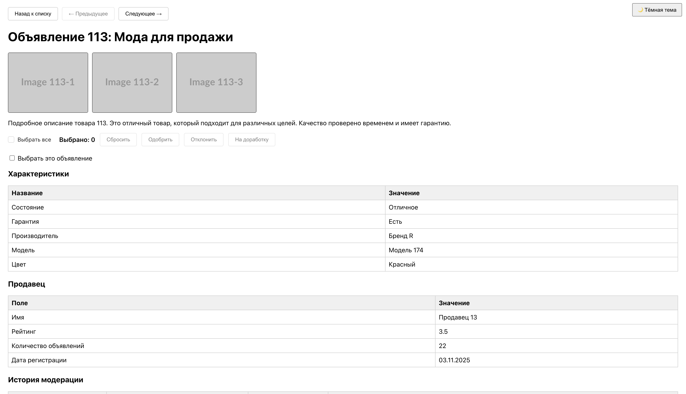
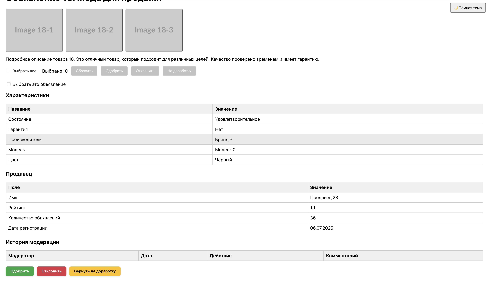
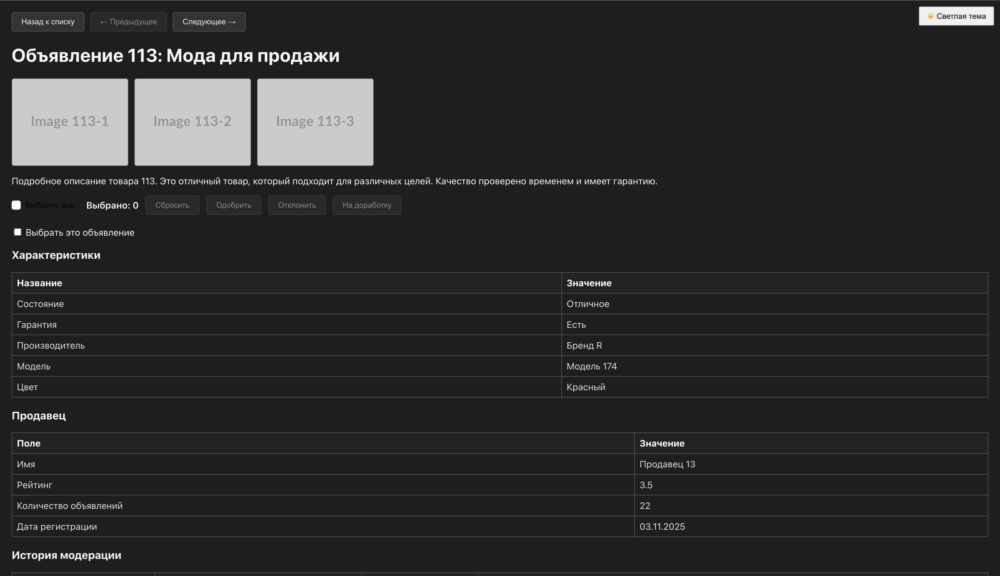
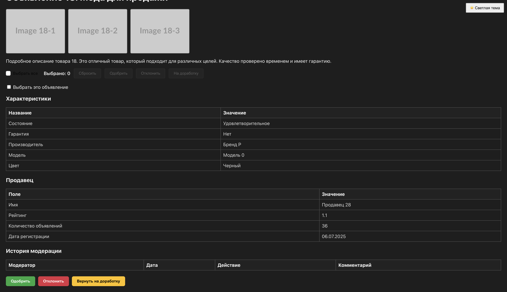
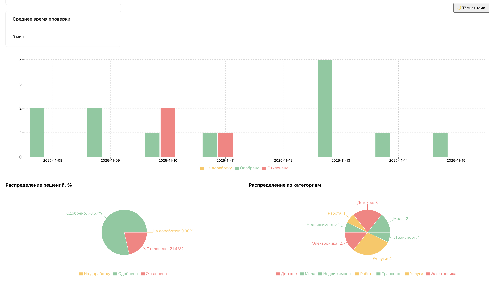
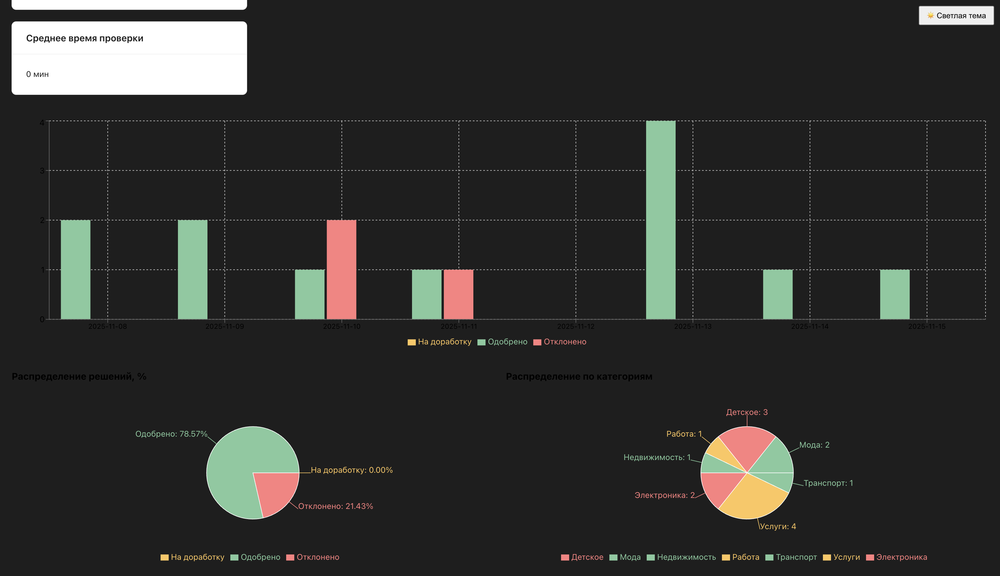

# Тестовое задание для стажёра Frontend (осенняя волна 2025)

**Выполнил:** [https://github.com/SweatShot](https://github.com/SweatShot) — Титов Никита Михайлович  

### Краткое описание
Необходимо разработать веб-приложение для модерации объявлений на платформе Авито. Система должна позволять модераторам просматривать, проверять и управлять объявлениями пользователей. Основная цель — создать удобный и быстрый инструмент для работы модераторов с объявлениями.  

### Система управления объявлениями для модерации

#### Описание задачи
Веб-приложение представляет собой упрощённую версию внутренней системы Авито, используемой модераторами. С помощью приложения модераторы смогут:  
- Просматривать список новых объявлений;  
- Проверять их соответствие правилам площадки;  
- Принимать решения о публикации или отклонении;  
- Отслеживать эффективность своей работы.  

#### Бизнес-контекст
Ежедневно на платформе публикуются тысячи объявлений, и каждому требуется модерация перед публикацией. Удобный и быстрый инструмент позволяет минимизировать время проверки и повышает качество контроля контента.  

---

# avito-test-task

### Сборка
```bash
docker compose up --build -d
```

### Запуск

Работает по адресам:

# http://localhost:8080

# http://localhost:8080/list

Решение возможных проблем сборки

Если сборка не прошла (чего быть не должно), нужно раскомментировать прокси в файле vite.config.ts:

```ts
// server: {
//   open: true,
//   proxy: {
//     "/api": {
//       target: "http://localhost:3001", 
//       changeOrigin: true,
//       secure: false,
//     },
//   },
// },
```

Затем зайти в frontend/src/app/shared/api/api.ts и настроить базовый URL для API:

```ts
import { createApi, fetchBaseQuery, retry } from "@reduxjs/toolkit/query/react"
// import { BASE_URL } from "../../../constants"

const baseQuery = fetchBaseQuery({
  baseUrl: `/api/v1`, // если используется прокси: `${BASE_URL}/api/v1`
})
```

Далее написать запустить локально frontend через 
```bash
npm run dev
```
и backend через
```bash
npm run start
```

## Стек технологий

Для разработки веб-приложения использовались следующие основные технологии и библиотеки:

- **React 19** — библиотека для построения пользовательского интерфейса.  
- **React DOM** — для рендеринга React-компонентов в браузере.  
- **React Router 7** и **React Router DOM 7** — управление маршрутизацией и навигацией внутри приложения.  
- **Redux Toolkit 2** и **React Redux 9** — управление состоянием приложения с использованием современного Redux API.  
- **Ant Design 5** — UI-библиотека для быстрого создания красивых и удобных компонентов интерфейса.  
- **Framer Motion 12** — библиотека для анимаций и плавных переходов в интерфейсе.  
- **Recharts 3** — библиотека для визуализации данных с помощью графиков и диаграмм.  
- **jsPDF 3** — генерация PDF-документов прямо из веб-приложения.  

Данный стек позволяет создавать современный, динамичный и отзывчивый интерфейс для модерации объявлений с удобной визуализацией данных и анимациями.

## Технические и функциональные требования

### Технические требования

**Обязательные:**
- Node.js v20+ ✅  
- React v18+ ✅  
- React Router DOM для маршрутизации ✅  
- Использование готового API из папки `server` ✅  
- Исходный код с GitHub с README и инструкцией по запуску ✅  

**Дополнительные:**
- Использование любой UI-библиотеки ⭐ ✅  
- Желательно TypeScript ✅ 
- Линтер (ESLint) ⭐ ➖ (не настроен)  
- Prettier ⭐ ✅  
- Система сборки (Vite/webpack) ⭐ ✅  
- Асинхронные HTTP-запросы (Axios, React Query) ⭐ ✅  
- Контейнеризация с Docker/Docker Compose ⭐ ✅  
- Покрытие юнит-тестами ⭐ ➖ (не реализовано)  
- Комментарии и документация ⭐ ✅  

---

### Функциональные требования

#### 1. Главная страница — Список объявлений (`/list`)
- Отображение списка объявлений в виде карточек ✅  
- Карточка содержит:
  - Изображение товара ✅  
  - Название ✅  
  - Цена ✅  
  - Категория ✅  
  - Дата создания ✅  
  - Статус (на модерации / одобрено / отклонено) ✅  
  - Индикатор приоритета (обычный / срочный) ✅  

**Фильтрация и поиск:**
- Фильтр по статусу ✅  
- Фильтр по категории ➖ (есть баг с пагинацией и продвинутыми фильтрами по категориям)  
- Фильтр по диапазону цен ✅  
- Поиск по названию ✅  
- Сброс всех фильтров ✅  

**Сортировка:**
- По дате создания ✅  
- По цене ✅  
- По приоритету ✅  

**Пагинация:**
- По 10 объявлений на страницу ✅  
- Навигация между страницами ✅  
- Отображение общего количества объявлений ✅  

#### 2. Страница детального просмотра объявления (`/item/:id`)
- Открытие детальной страницы при клике на карточку ✅  
- Информация об объявлении:
  - Галерея изображений (≥3) ✅  
  - Полное описание ✅  
  - Характеристики товара ✅  
- Информация о продавце:
  - Имя ✅  
  - Рейтинг ✅  
  - Количество объявлений ✅  
  - Дата регистрации ✅  
- История модерации:
  - Список всех действий ✅  
  - Имя модератора ✅  
  - Дата и время ✅  
  - Принятое решение ✅  
  - Комментарий (если был) ✅  

**Панель действий модератора:**
- Кнопка «Одобрить» ✅  
- Кнопка «Отклонить» ✅  
- Кнопка «Вернуть на доработку» ✅  
- Обязательное поле причины при отклонении ✅  
- Быстрые шаблоны причин ✅  

**Навигация:**
- Кнопка «Назад к списку» ✅  
- Кнопки «Предыдущее» / «Следующее» ✅  

#### 3. Страница статистики модератора (`/stats`)
- Общая статистика:
  - Карточки с метриками ✅  
  - Всего проверено объявлений ✅  
  - Процент одобренных / отклоненных ✅  
  - Среднее время проверки ✅  
- Графики:
  - Активность по дням ✅  
  - Круговая диаграмма распределения решений ✅  
  - График по категориям ✅  

#### 4. Дополнительные функциональные возможности ⭐
- Горячие клавиши ✅  
  - A — одобрить, D — отклонить, → — следующее, ← — предыдущее, / — фокус на поиск  
- Bulk-операции ✅ ➖ (при использовании горячих клавиш возможны баги: нужно кликнуть на пустую область)  
- Продвинутая фильтрация ✅  
- Тёмная тема ✅  
- Экспорт данных:
  - CSV ✅  
  - PDF ✅  
- Real-time обновления ➖ (не реализовано):
  - Автообновление списка новых объявлений  
  - Счётчик новых объявлений  
  - Статус объявления  
- Анимации ✅  
  - Плавные переходы, появление карточек, progress bar  
- Фильтр по периоду на странице статистики ✅  
  - Сегодня, последние 7 дней, последние 30 дней

## API

Приложение использует готовый API для работы с объявлениями и статистикой модераторов. Для взаимодействия с сервером применяется **RTK Query** через `api`-слой (`frontend/src/app/shared/api`).  

### Основные эндпоинты

#### Объявления (`adsApi`)
- **`getAds`** — получить список объявлений с поддержкой пагинации, фильтров и сортировки.  
- **`getAllIds`** — получить список всех ID объявлений (для навигации).  
- **`getAdById`** — получить детальную информацию по объявлению.  
- **`approveAd`** — одобрить объявление.  
- **`rejectAd`** — отклонить объявление с указанием причины.  
- **`requestChanges`** — запросить доработку объявления с указанием причины.  

**Хуки для компонентов:**  
```ts
useGetAdsQuery, useGetAdByIdQuery, useGetAllIdsQuery, 
useApproveAdMutation, useRejectAdMutation, useRequestChangesMutation
```

## API строго типизировано через интерфейсы

```ts
// API для модерации объявлений

export interface Advertisement {
  id: number;
  title: string;
  description: string;
  price: number;
  category: string;
  categoryId: number;
  status: "pending" | "approved" | "rejected" | "draft";
  priority: "normal" | "urgent";
  createdAt: string; // date-time
  updatedAt: string; // date-time
  images: string[];
  seller: Seller;
  characteristics: Record<string, string>;
  moderationHistory: ModerationHistory[];
}

export interface Seller {
  id: number;
  name: string;
  rating: string;
  totalAds: number;
  registeredAt: string; // date-time
}

export interface ModerationHistory {
  id: number;
  moderatorId: number;
  moderatorName: string;
  action: "approved" | "rejected" | "requestChanges";
  reason?: string | null;
  comment?: string;
  timestamp: string; // date-time
}

export interface Pagination {
  currentPage: number;
  totalPages: number;
  totalItems: number;
  itemsPerPage: number;
}

export interface StatsSummary {
  totalReviewed: number;
  totalReviewedToday: number;
  totalReviewedThisWeek: number;
  totalReviewedThisMonth: number;
  approvedPercentage: number;
  rejectedPercentage: number;
  requestChangesPercentage: number;
  averageReviewTime: number;
}

export interface ActivityData {
  date: string; // date
  approved: number;
  rejected: number;
  requestChanges: number;
}

export interface DecisionsData {
  approved: number;
  rejected: number;
  requestChanges: number;
}

export interface ModeratorStats {
  totalReviewed: number;
  todayReviewed: number;
  thisWeekReviewed: number;
  thisMonthReviewed: number;
  averageReviewTime: number;
  approvalRate: number;
}

export interface Moderator {
  id: number;
  name: string;
  email: string;
  role: string;
  statistics: ModeratorStats;
  permissions: string[];
}

export interface BadRequestResponse {
  error: string;
  message: string;
}

export interface NotFoundResponse {
  error: string;
  id: number;
}

export interface InternalServerErrorResponse {
  error: string;
  message: string;
}

export interface GetAdsResponse {
  ads: Advertisement[];
  pagination: Pagination;
}

export interface GetAdByIdResponse extends Advertisement {}

export interface ApproveAdResponse {
  message: string;
  ad: Advertisement;
}

export interface RejectAdResponse {
  message: string;
  ad: Advertisement;
}

export interface RequestChangesResponse {
  message: string;
  ad: Advertisement;
}

export interface StatsSummaryResponse extends StatsSummary {}

export type ActivityChartResponse = ActivityData[];

export interface DecisionsChartResponse extends DecisionsData {}

export interface CategoriesChartResponse {
  [category: string]: number;
}

export interface ModeratorMeResponse extends Moderator {}

export interface RejectAdRequest {
  reason:
    | "Запрещенный товар"
    | "Неверная категория"
    | "Некорректное описание"
    | "Проблемы с фото"
    | "Подозрение на мошенничество"
    | "Другое";
  comment?: string;
}

export interface RequestChangesRequest {
  reason:
    | "Запрещенный товар"
    | "Неверная категория"
    | "Некорректное описание"
    | "Проблемы с фото"
    | "Подозрение на мошенничество"
    | "Другое";
  comment?: string;
}

export interface GetAdsQuery {
  page?: number;
  limit?: number;
  status?: ("pending" | "approved" | "rejected" | "draft")[];
  categoryId?: number;
  minPrice?: number;
  maxPrice?: number;
  search?: string;
  sortBy?: "createdAt" | "price" | "priority";
  sortOrder?: "asc" | "desc";
}

export interface StatsQuery {
  period?: "today" | "week" | "month" | "custom";
  startDate?: string; // YYYY-MM-DD
  endDate?: string;   // YYYY-MM-DD
}
```


## Основной компонент приложения (`App.tsx`)

Главный компонент приложения оборачивает всё приложение в необходимые провайдеры и роутинг:

``
import { BrowserRouter } from "react-router-dom"
import "./App.css"
import AppRouter from "./app/routes/AppRouter"
import { ThemeProvider } from "./context/ThemeContext"
import ThemeToggleButton from "./components/ThemeToggleButton/ThemeToggleButton"
import { ToastProvider } from "./context/ToastContext"
import { ToastContainer } from "./components/Toast/ToastContainer"

export const App = () => {
  return (
    <BrowserRouter>
      <ThemeProvider>
        <ToastProvider>
          <ThemeToggleButton />
          <main>
            <AppRouter />
          </main>
          <ToastContainer />
        </ToastProvider>
      </ThemeProvider>
    </BrowserRouter>
  )
}
```

### Скриншоты проекта 

## Список объявлений (светлая тема) 
path: "/list"


## Список объявлений (темная тема)
path: "/list"


## Страница с объявлением (светлая тема)
path: "/item/:id"



---



## Страница с объявлением (темная тема)
path: "/item/:id"



---



## Страница статистики модерации (светлая тема)
/stats


---



## Страница статистики модерации (темная тема)
/stats


---



